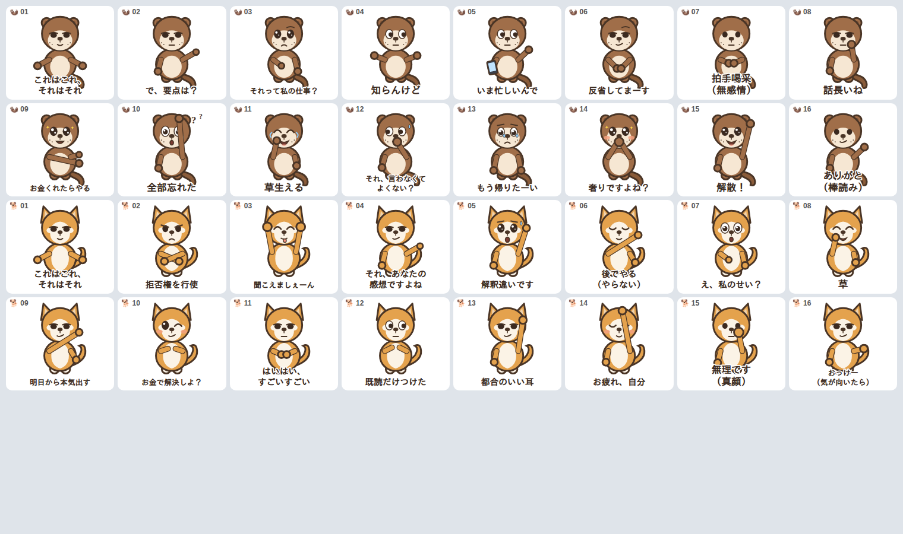

# LINEスタンプ制作キット（カワウソ＆柴犬）

毒舌・ゆるかわ系のLINEスタンプ **32個（案A）** を、キャラクターデザインから申請用ファイルまで一式そろえたリポジトリです。**そのまま LINE Creators Market に申請できる完成PNG**を同梱しています。



---

## ✅ 完成物（申請にそのまま使えます）

| 種類 | 場所 | 内容 |
|------|------|------|
| **スタンプ本体（文字入り・完成版）** | [`stickers/png/`](stickers/png/) | `otter-01`〜`16`、`shiba-01`〜`16` の32枚（370×320px・透過PNG） |
| **メイン画像** | [`stickers/png/main-240.png`](stickers/png/main-240.png) | 240×240px |
| **トークルームタブ画像** | [`stickers/png/tab-96x74.png`](stickers/png/tab-96x74.png) | 96×74px |
| **文字なし版（Canva編集用）** | [`stickers/png-notext/`](stickers/png-notext/) | 文字を自分で入れ直したいとき用の32枚 |
| **ソース（SVGベクター）** | [`stickers/svg/`](stickers/svg/) | 色・線・ポーズを再編集したいとき用 |

すべて **透過PNG／RGBA／各35KB前後（上限1MB）** で、LINEの規格を満たしています。

> 文字はデザインに直接焼き込み済みです。フォントやレイアウトを自分で調整したい場合は `png-notext/` を使い、下記「文字入れ規格」に沿って Canva で入れてください。

---

## スタンプ一覧（見出し＝入っている文字）

**🦦 カワウソ（16種）**

| # | 文字 | # | 文字 |
|---|------|---|------|
| 01 | これはこれ、それはそれ | 09 | お金くれたらやる |
| 02 | で、要点は？ | 10 | 全部忘れた |
| 03 | それって私の仕事？ | 11 | 草生える |
| 04 | 知らんけど | 12 | それ、言わなくてよくない？ |
| 05 | いま忙しいんで | 13 | もう帰りたーい |
| 06 | 反省してまーす | 14 | 奢りですよね？ |
| 07 | 拍手喝采（無感情） | 15 | 解散！ |
| 08 | 話長いね | 16 | ありがと（棒読み） |

**🐕 柴犬（16種）**

| # | 文字 | # | 文字 |
|---|------|---|------|
| 01 | これはこれ、それはそれ | 09 | 明日から本気出す |
| 02 | 拒否権を行使 | 10 | お金で解決しよ？ |
| 03 | 聞こえましぇーん | 11 | はいはい、すごいすごい |
| 04 | それ、あなたの感想ですよね | 12 | 既読だけつけた |
| 05 | 解釈違いです | 13 | 都合のいい耳 |
| 06 | 後でやる（やらない） | 14 | お疲れ、自分 |
| 07 | え、私のせい？ | 15 | 無理です（真顔） |
| 08 | 草 | 16 | おっけー（気が向いたら） |

---

## LINE Creators Market への申請手順

1. [LINE Creators Market](https://creator.line.me/) にログイン（要クリエイター登録）。
2. 「スタンプ」→「新規登録」。個数は **32個**（本キットはこの案Aに対応）。
3. 画像を登録：
   - **スタンプ画像**：`stickers/png/` の32枚をアップロード。
   - **メイン画像**：`stickers/png/main-240.png`。
   - **トークルームタブ画像**：`stickers/png/tab-96x74.png`。
4. タイトル・説明文・販売価格・販売地域を入力。
5. リクエスト（審査）を送信。審査通過後に販売開始。

> ⚠️ **個数は 8 / 16 / 24 / 32 / 40個 のいずれか**のみ（30個では申請不可）。本キットは各キャラ16種＝**32個**ちょうどです。24個にしたい場合は各キャラから4種外してください。

---

## 文字入れ・書き出し規格（`png-notext/` から自作する場合）

| 用途 | サイズ | メモ |
|------|--------|------|
| スタンプ本体 | 370×320px（幅・高さ偶数） | 全周に約10pxの余白。文字は上下端に寄せ、顔に重ねない。 |
| メイン画像 | 240×240px | 一番かわいいポーズを流用。 |
| トークルームタブ画像 | 96×74px | 顔アップを流用。 |

- **形式**：背景透過PNG／RGB／1ファイル1MB以下。
- **フォント**：本キットは **M PLUS Rounded 1c（Bold）** を使用（Canvaでも使える丸ゴシック・商用OK）。他候補：Kosugi Maru / Zen Maru Gothic。
- **可読性**：濃い色の文字＋白フチ（本キットは白フチ7px相当）。ダークモードのトーク背景でも読めるようにするため。
- 32枚でフォント・サイズ・縁取りを統一する（審査・見栄えの両面で有利）。

---

## 絵柄を作り直したいとき

このリポジトリのキャラクターは**ベクター（SVG）で自作**したものです。再生成やポーズ追加ができます。

```bash
# 依存: Node.js と Playwright(Chromium)、フォント "M PLUS Rounded 1c"
NODE_PATH=$(npm root -g) node build/index.js
```

- [`build/characters.js`](build/characters.js) … キャラ本体・表情・腕ポーズの定義
- [`build/stickers.js`](build/stickers.js) … 32個のセリフ↔表情/ポーズの対応表
- [`build/index.js`](build/index.js) … 全PNG（文字入り・文字なし・メイン・タブ）とコンタクトシートを書き出し
- [`build/render.js`](build/render.js) … SVG→透過PNG レンダラ（Chromium）

AI画像生成でリッチな絵柄にしたい場合の**プロンプト集**も用意しています。

- 🦦 [`prompts/カワウソ.md`](prompts/カワウソ.md) … ベースプロンプト＋ポーズ16種
- 🐕 [`prompts/柴犬.md`](prompts/柴犬.md) … ベースプロンプト＋ポーズ16種

> AI生成する場合の注意：自分で生成したベース画像を参照させるのはOK。他人の既存イラストの参照はNG。参照画像を添付するときは、プロンプト先頭に「添付キャラの絵柄・体型・色を完全に維持したまま、次のポーズに変更して：」と足すと絵柄が安定します（各プロンプトに同梱済み）。

---

## 制作チェックリスト

- [x] カワウソ 16ポーズ（透過・文字入り）
- [x] 柴犬 16ポーズ（透過・文字入り）
- [x] メイン画像 240×240px
- [x] トークルームタブ画像 96×74px
- [x] 全ファイル 透過・RGBA・1MB以下・規定サイズ
- [ ] LINE Creators Market にアップロード
- [ ] タイトル・説明文・価格を入力して審査申請
